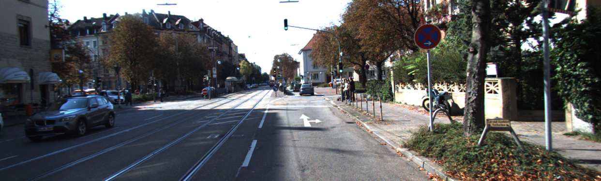

# FlowDiffusion_pytorch
This repo contains all codes and models of our technique report [open DDVM](https://arxiv.org/abs/2312.01746), including an unofficial pytorch implementation of [DDVM](https://diffusion-vision.github.io/).

## Results

<figure class="half">
    
    
</figure>

AF-pretraining:

|                | Pretraining       | Network               | Iteration | Sintel.clean | Sintel.final | KITTI | KITTI Fl-all |
|:--------------:|-------------------|-----------------------|-----------|:------------:|:------------:|:-----:|:------------:|
|     Paper      | Palette-style     | Efficient U-Net                | Unknow    |     2.04     |     2.55     | 4.47  |    16.59%    |
|   This repo    | From the Scratch  | Efficient U-Net                | 305k      |     2.96     |     3.97     | 6.21  |    20.38%    |
|   This repo    | From the Scratch  | Efficient U-Net                | 900k      |     2.77     |     3.76     | 5.44  |    18.57%    |
|   This repo    | From the Scratch  | Efficient U-Net + Corr. Volume | 305k      |     2.98     |     3.85     | 5.53  |    19.04%    |


## Requirements
```shell
conda create --name ddvm
conda activate ddvm
pip install -r requirement.txt
```

## Models
We provide pretrained models on the [releases page](https://github.com/DQiaole/FlowDiffusion_pytorch/releases/tag/v1.0.0). The default path of the models for evaluation is:
```Shell
├── check_points
    ├── autoflow-ImagenUnet/pipeline-900000
    ├── autoflow-CorrUnet/pipeline-305000
```

## Data Preparation
To evaluate/train our model, you will need to download the required datasets. 
* [Sintel](http://sintel.is.tue.mpg.de/)
* [KITTI](http://www.cvlibs.net/datasets/kitti/eval_scene_flow.php?benchmark=flow)
* [AutoFlow](https://autoflow-google.github.io/)

By default `set_up_dataset.py` will search for the datasets in these locations. You can create symbolic links to wherever the datasets were downloaded in the `datasets` folder

```Shell
├── datasets
    ├── Sintel
        ├── test
        ├── training
    ├── KITTI
        ├── testing
        ├── training
        ├── devkit
    ├── AutoFlow
```

## Training
```shell
accelerate config
# Train ImagenUnet
accelerate launch --num_processes 8 train_flow_prediction.py --stage 'autoflow' --train_batch_size 16 --image_size 320 448 --dataloader_num_workers 16 --num_steps 1000000 --save_images_steps 500 --gradient_accumulation_steps 1 --lr_warmup_steps 10000 --use_ema --mixed_precision 'bf16' --prediction_type 'sample' --ddpm_num_steps 64 --checkpointing_steps 10000 --checkpoints_total_limit 5 --output_dir "check_points/autoflow-ImagenUnet" --max_flow 400 --learning_rate 1e-4 --adam_weight_decay 0.0001 --it_aug --add_gaussian_noise --normalize_range --lr_scheduler 'cosine'
# Train CorrUnet
accelerate launch --num_processes 8 train_flow_prediction.py --stage 'autoflow' --train_batch_size 16 --image_size 320 448 --dataloader_num_workers 16 --num_steps 1000000 --save_images_steps 500 --gradient_accumulation_steps 1 --lr_warmup_steps 10000 --use_ema --mixed_precision 'bf16' --prediction_type 'sample' --ddpm_num_steps 64 --checkpointing_steps 10000 --checkpoints_total_limit 5 --output_dir "check_points/autoflow-CorrUnet" --max_flow 400 --learning_rate 1e-4 --adam_weight_decay 0.0001 --it_aug --add_gaussian_noise --normalize_range --lr_scheduler 'cosine' --Unet_type 'RAFT_Unet'
```

## Evaluation
```shell
python evaluate_diffusers_warprefine.py --pipeline_path check_points/xxx/pipeline-xxx --normalize_range --validation kitti sintel
```

## License
This repo is released under the Apache License

## Citation
```bibtex
@article{saxena2023surprising,
  title={The Surprising Effectiveness of Diffusion Models for Optical Flow and Monocular Depth Estimation},
  author={Saxena, Saurabh and Herrmann, Charles and Hur, Junhwa and Kar, Abhishek and Norouzi, Mohammad and Sun, Deqing and Fleet, David J},
  journal={arXiv preprint arXiv:2306.01923},
  year={2023}
}

@misc{dong2023openddvm,
  title = {Open-DDVM: A Reproduction and Extension of Diffusion Model for Optical Flow Estimation},
  author = {Dong, Qiaole and Zhao, Bo and Fu, Yanwei},
  journal = {arXiv preprint arXiv:2312.01746},
  year = {2023}}
}
```

## Acknowledgements
Thanks to previous open-sourced repo:
- Thanks to [RAFT](https://github.com/princeton-vl/RAFT)
- Thanks to [RAFT-it](https://github.com/google-research/opticalflow-autoflow)
- Thanks to [Imagen-pytorch](https://github.com/lucidrains/imagen-pytorch)
- Thanks to [accelerate](https://github.com/huggingface/accelerate)
